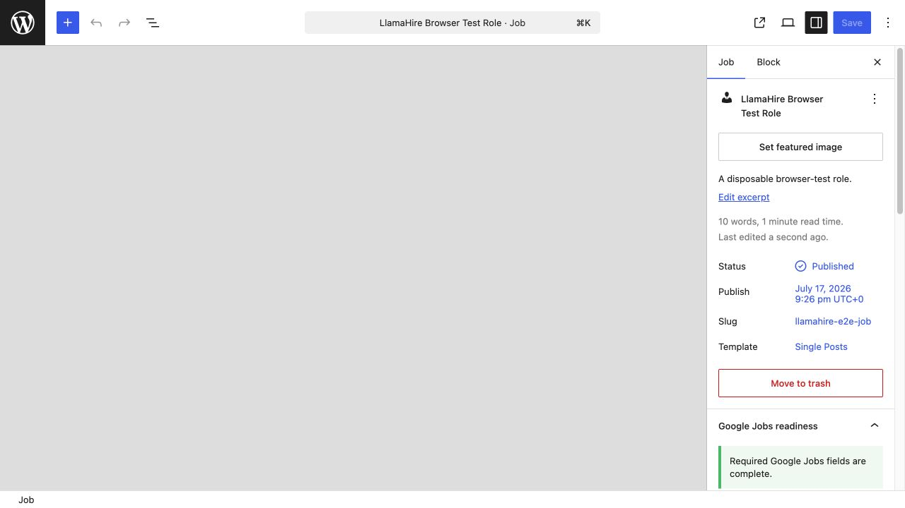
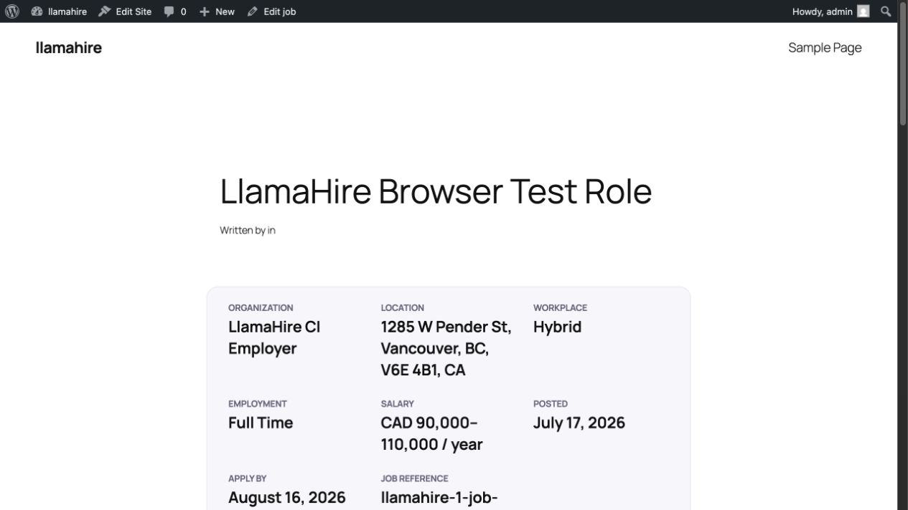
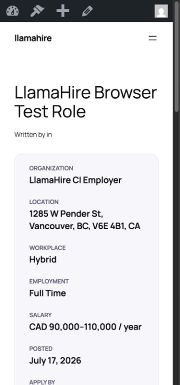
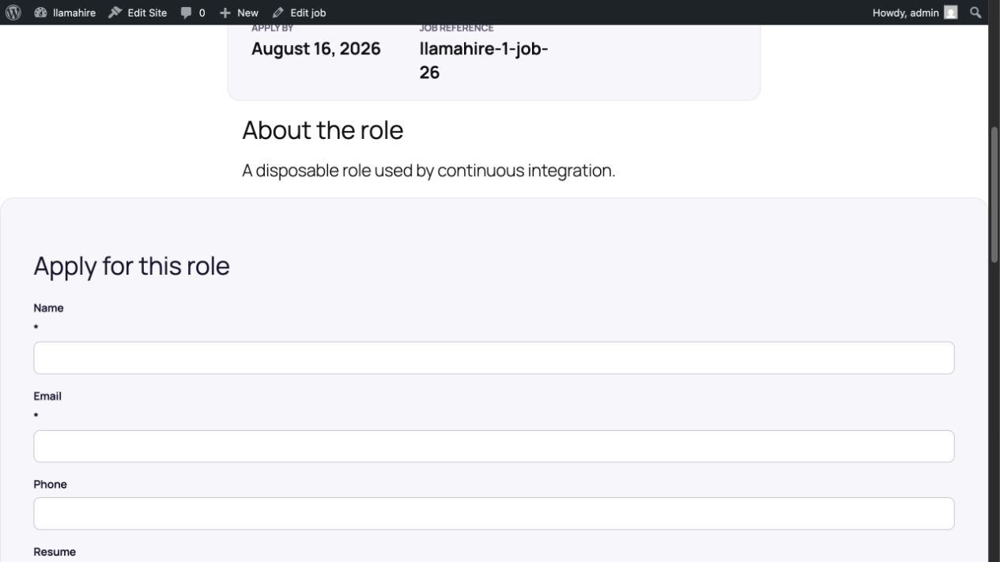
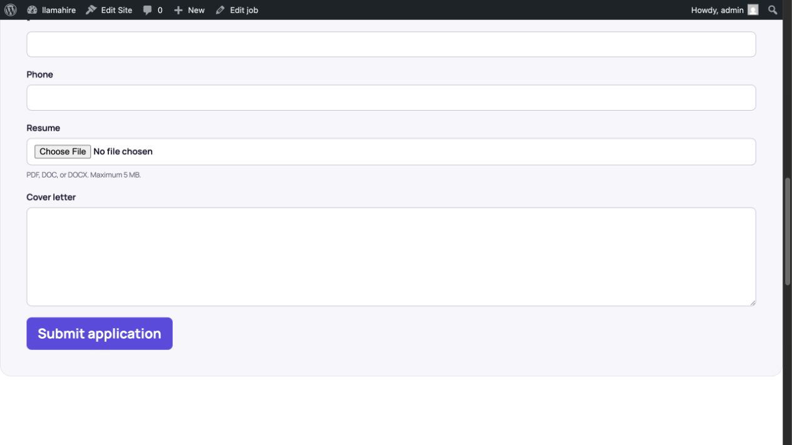
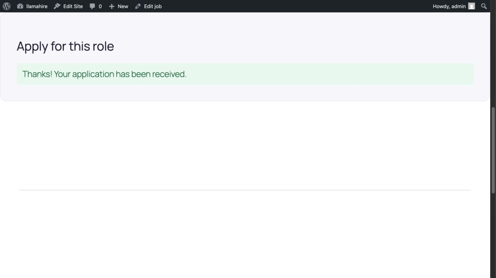
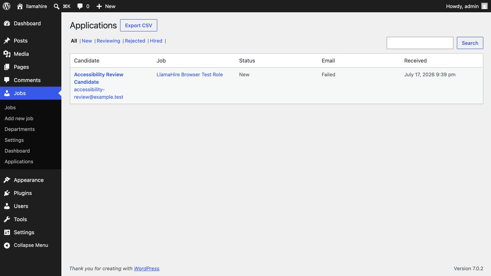
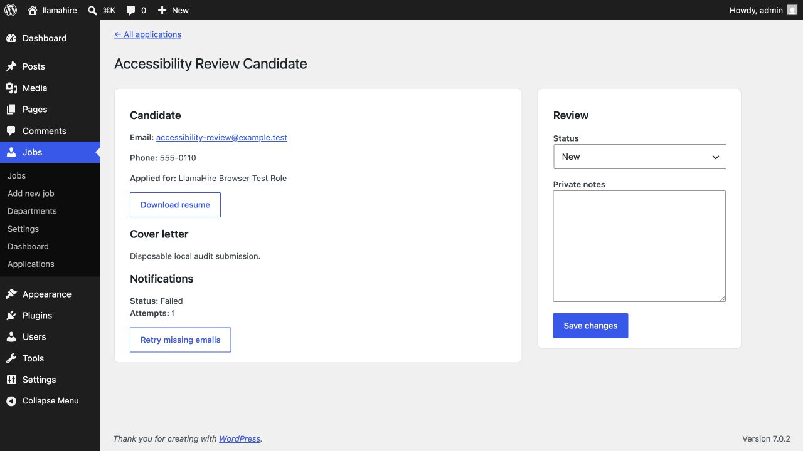

# Stabilized vertical-slice release review

Date: 2026-07-17

## Verdict

The Free plugin's first end-to-end hiring slice is coherent and its Google Jobs model is substantially correct. No critical candidate-data disclosure was found. The confirmed hardening findings from this review were implemented and retested on 2026-07-17:

1. Real calendar dates, positive salary boundaries, ordered ranges, and valid currencies now fail safe on the server and in schema generation.
2. Public submissions now have per-client and per-job throttles, resume signature/container checks, an external security-validation hook, and production storage that fails closed outside the web root.
3. CSV formula protection covers leading whitespace and byte-order marks, the form includes candidate-data-use copy, and the recruiter notification column is accurately labelled.
4. The actionable Plugin Check errors were corrected. The release-equivalent scan now has no errors; remaining warnings are reviewed read-only request, custom-table, standard content-filter, and intentional private-storage cases.

The empty editor canvas appeared only in one automated audit capture and was not reproduced by the normal editor workflow. It is deferred as an environment-specific observation rather than a release blocker.

## Scope and evidence

The review covered the authenticated job editor, public job details, application submission, confirmation, recruiter application list and detail, responsive layout, JobPosting JSON-LD, public upload boundary, candidate-data access controls, CSV export hardening, and a scoped Plugin Check run against the installable runtime.

The disposable test site used WordPress 7.0.2. The review used realistic fixture data and one disposable candidate submission. Accepted visual evidence is stored beside this report. The rejected stitched full-page capture (`02-public-job-and-application.png`) is intentionally excluded because it duplicated content while stitching.

## Flow review

### 1. Job editor — blocked

The job-settings sidebar renders with useful grouping, status, and readiness guidance. However, the editor canvas remained empty after loading. The iframe contained no editor content, and the browser reported deprecation warnings but no JavaScript error. Treat this as a release-blocking compatibility reproduction, not yet as a proven plugin root cause. Existing end-to-end coverage exercises sidebar controls but does not assert that the main editor content renders.

### 2. Public job details — healthy with theme caveat

Salary, workplace, employment type, location, and deadline are visible and agree with the JSON-LD fixture. The facts use semantic description-list markup. At 360 px the layout reflows to one column with no horizontal overflow. The default theme rendered an empty “Written by … in …” metadata fragment; that is a compatibility/content-quality issue to address in theme testing.

### 3. Application form — healthy foundation, abuse controls missing

Visible controls have labels and native required states, and the honeypot is hidden from assistive technology and keyboard order. The form does not include a privacy/retention notice. A comprehensive keyboard and screen-reader pass was not performed, so this is not a WCAG conformance claim.

### 4. Submission confirmation — healthy

The successful state is clear and exposed through a status region. Duplicate-submission protection is database-enforced and notification delivery state is kept separately from application acceptance.

### 5. Recruiter application list — needs correction

Candidate, job, review status, notification result, and received date are scannable. The fourth column originally said “Email” while displaying notification status; it is now labelled “Email status” (`includes/class-admin.php:58-59`).

### 6. Recruiter review — healthy foundation

The detail view supports capability-protected resume download, notification visibility/retry, status changes, and private notes. Candidate values are escaped in the rendered admin UI.

## Google Jobs SEO review

The singular job fixture emits a `JobPosting` entity with `title`, `description`, `datePosted`, `hiringOrganization`, `jobLocation`, `employmentType`, `identifier`, `directApply`, salary, and `validThrough`. Those values were visible on the page. Hybrid work correctly remained a physical-location job, while the schema builder has the expected `TELECOMMUTE` plus applicant-location model for fully remote jobs. Closed and expired fixtures omit JobPosting markup.

This aligns with [Google Search Central's JobPosting documentation](https://developers.google.com/search/docs/appearance/structured-data/job-posting): structured values must match visible content; remote jobs need eligible applicant locations; salary must be an actual employer-provided base salary; and expired jobs must be removed or clearly expired.

Findings and follow-up:

- Resolved: application deadlines now require a real calendar date, and schema generation defensively ignores invalid legacy values instead of throwing.
- Resolved: salary boundaries must be numeric and positive, ranges must be ordered, and invalid currency no longer silently becomes USD. Invalid compensation is omitted from visible output and JSON-LD.
- The plugin cannot yet guarantee that descriptions contain the substantive responsibilities, qualifications, and other detail Google recommends; readiness currently checks presence, not content quality.
- Indexing API handling is not implemented, and sitemap lifecycle behavior could not be verified in this local browser environment. A hosted staging URL is also required for Google's Rich Results Test and URL Inspection.

## Security review

Strong foundations observed:

- Public submission requires a per-job nonce and a published, open job.
- Administrative mutations and protected resume downloads use nonces and granular capabilities.
- Resume paths use random identifiers and are not exposed through public service responses.
- Storage prefers a location outside the web root; downloads use no-cache and `nosniff` headers.
- Application searches are bounded, dynamic values are prepared, duplicate submissions are idempotent, and CSV values beginning with common formula characters are prefixed.

Findings and follow-up:

- Resolved baseline: the unauthenticated route now applies keyed per-client and aggregate per-job limits before storing an upload. High-traffic sites should still add host or edge enforcement.
- Resolved baseline: PDF, DOC, and DOCX content signatures are checked; DOCX containers receive deeper checks when `ZipArchive` is available; and a filter lets a trusted scanner reject files.
- Resolved: production storage fails closed when the private directory cannot be created outside the web root. The protected fallback remains available by default only in local/development environments and requires explicit production opt-in.
- Resolved: CSV formula detection now looks through leading control/space characters and a UTF-8 byte-order mark.
- Resolved baseline: the form explains how candidate information is used and links to the configured WordPress privacy policy. A site-specific policy must still define its retention period.

No critical unauthorized candidate-data read or direct resume-path exposure was found in this review.

## Plugin Check

The release-equivalent Plugin Check scan now reports no errors. The implementation added:

- Translator comments for formatted strings.
- A direct-access guard for the careers pattern.
- The WordPress.org-safe name “LlamaHire – Job Board & Careers”.
- Removal of the unnecessary `load_plugin_textdomain()` call on the supported WordPress range.
- Narrow, justified suppressions for exception text and private file streaming operations that Plugin Check had misclassified as rendered output or replaceable filesystem work.

Remaining warnings are reviewed rather than mechanically changed: the intentional custom applications table, read-only filtered GET requests, the standard `the_content` filter, and bounded direct queries already covered by the backend performance review.

## Evidence limits

- No complete keyboard-only, screen-reader, or automated accessibility-engine pass was performed.
- One editor capture appeared empty, but the normal authenticated editor workflow subsequently passed and the issue was not reproduced.
- A local site cannot be tested by Google's Rich Results Test or URL Inspection.
- Local sitemap navigation was blocked by the in-app browser, so sitemap inclusion/removal was not established.
- This was a targeted source and runtime review, not a third-party penetration test or legal compliance opinion.

## Recommended implementation order

1. Completed: strict server-side job-domain validation and fail-safe schema generation.
2. Completed baseline: submission throttling, document validation, and production-safe private storage.
3. Completed: applications label, candidate-data-use copy, expanded CSV protection, and actionable Plugin Check findings.
4. Next: run a dedicated keyboard and screen-reader pass.
5. Validate a hosted staging job in Rich Results Test and URL Inspection, then verify sitemap and expired-job lifecycle behavior.
