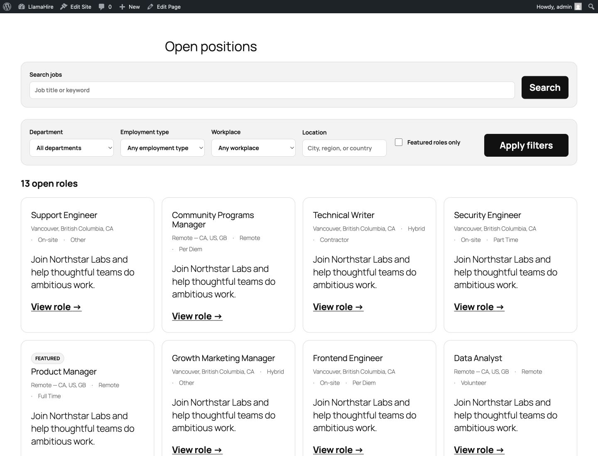
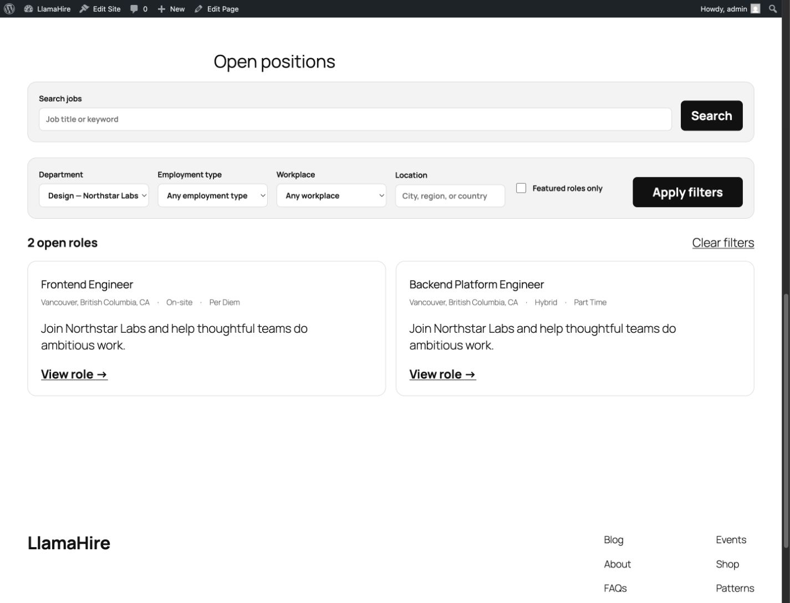
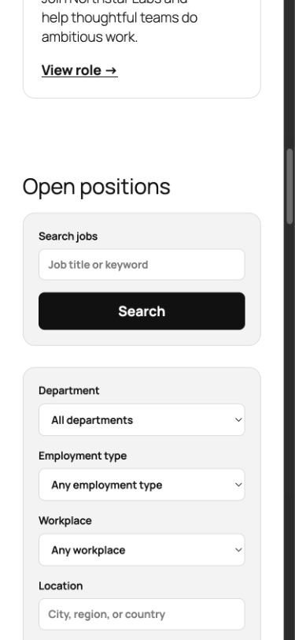
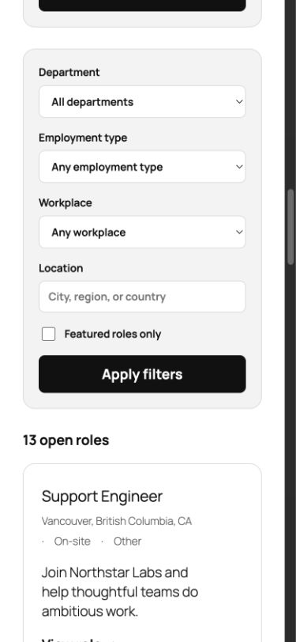

# Frontend and Job Filters review

Date: July 30, 2026

## Scope

This review covers the public-facing LlamaHire blocks, patterns, templates, and the Job Filters experience on the WordPress Studio site at `http://localhost:8896/`. It combines a visual review at 1440px and 390px with an inspection of the current server-rendered block contract.

The user goal is to find an open role quickly while keeping the result URL shareable, reloadable, crawlable, keyboard-friendly, and easy for a theme to restyle.

## Frontend inventory

### Dynamic blocks

1. **Jobs Directory** — results count, job-card grid, empty state, pagination, and optionally built-in search/filters.
2. **Job Search** — keyword search.
3. **Job Filters** — department, employment type, workplace, location, and featured-only controls.
4. **Job Card** — reusable job summary used by directory and featured collections.
5. **Featured Jobs** — curated collection of featured open roles.
6. **Single Job Details** — structured job facts.
7. **Application Form** — native, external-link, or email application path.

### Patterns

- Careers Page
- Careers Hero
- Featured Jobs Section
- Department Landing Page

### Public templates

- Single Job
- Jobs Archive
- Job Department archive

The architecture is sound: discovery state is server-owned in the URL, Search and Filters preserve one another, and Directory consumes the complete query. The current documentation already defines the Interactivity API as progressive enhancement rather than a replacement for semantic GET forms.

## Flow evidence

### Step 1 — Browse all roles

**Health: Good foundation; visually heavier than necessary.**



Strengths:

- Labels are clear and the controls use native form elements.
- The result count is prominent and connected visually to the job grid.
- Search, filters, and results inherit the theme typography.
- Cards have good spacing, hierarchy, and responsive grid behavior.

Risks:

- Search and filters are two large panels, which makes one discovery tool feel like two separate tasks.
- Six equal desktop columns give every filter and the submit button the same visual weight.
- “Apply filters” is the strongest control in the section even though changing a filter is the meaningful action.
- The default panel surface is pleasant but starts to resemble an admin/settings form.

### Step 2 — Apply a department filter

**Health: Functionally strong; interaction is slower than it needs to be.**



The current flow correctly navigates to a shareable URL and returns two matching roles. It also exposes a clear reset action.

Risks:

- Selecting a value produces no feedback until “Apply filters” is pressed.
- The full page reload returns the viewport to the top of the page; users must find the results again.
- The generated URL includes empty parameters for inactive controls.
- The active value only appears inside the select. There is no quick removable summary of active criteria.

### Step 3 — Browse filters on mobile

**Health: Usable; too tall for a lightweight filter task.**





Strengths:

- Controls reflow cleanly to one column.
- Selects and text fields are approximately 42–43px high and the submit button is about 50px high.
- Labels remain visible and the order is predictable.

Risks:

- The filter form alone is about 473px tall, in addition to the separate search card.
- A 390px-wide visitor must scroll through most of a screen of controls before reaching the result count.
- The 18px checkbox is smaller than the surrounding control targets; the label helps, but its interactive affordance is less obvious.

## Recommended Job Filters direction

### Use compact filter chips, but keep their native-control semantics

Do not render every possible department or employment type as a chip; those lists are too large and can grow. Instead, make each filter control look and behave like a compact chip trigger:

- `Department`
- `Job type`
- `Workplace`
- `Location`
- `Featured`

For the three finite select controls, retain native `<select>` elements and style the closed control as a rounded chip. Keep the accessible label in the markup; it can be visually hidden when the chip text is self-explanatory.

Active controls should use the selected value as their visible text, for example `Design`, `Full time`, or `Remote`. A small adjacent remove action may clear that one value. “Featured” can be a pressed toggle chip backed by the existing checkbox semantics.

Location is better as a compact text field than as a fake select. On mobile it can occupy a full row below the three select chips, or expand after a `Location` trigger is activated.

This pattern reduces vertical space while retaining native keyboard, touch, browser, and assistive-technology behavior.

### Combine the visual treatment of Search and Filters

Keep Search and Job Filters as independently insertable blocks, but make adjacent instances appear as one discovery surface:

- search field and search action on the first line;
- a wrapping filter-chip row beneath it;
- active-filter chips and result count directly above results.

Use `:where()` and sibling selectors for the combined default so themes can override it without specificity battles.

### Enhance changes automatically with the Interactivity API

The Interactivity API is a good fit and is available at the plugin's WordPress 6.5 minimum.

Recommended enhancement:

1. Preserve the existing GET forms as the no-JavaScript fallback.
2. Add one shared `llamahire/job-discovery` store to Search, Filters, and Directory.
3. On select or featured-toggle change, build the canonical URL from both forms, remove `job_page`, omit empty values, and call the Interactivity Router's `navigate()`.
4. Debounce keyword and location input by roughly 350–500ms; Enter should navigate immediately.
5. Make the Directory results area the router region so only the result count, clear action, cards, empty state, and pagination update.
6. Keep focus in the changed control, expose a loading state with `aria-busy`, and retain the existing polite result-count announcement.
7. Synchronize control values from the router URL after browser Back/Forward and after “Clear filters.”
8. Hide the submit button only after the interactive store has hydrated; it remains available if JavaScript or the router fails.

The router updates browser history, keeps server-rendered HTML and crawlable URLs, and provides navigation announcements. Scroll and focus still need explicit handling; they should not be assumed.

## Theme-customization improvements

Job Card and Single Job Details already expose native color, typography, spacing, and border supports. Apply the same model to Job Search, Job Filters, and Jobs Directory:

- text and background color;
- link color where applicable;
- typography;
- margin, padding, and block gap;
- border color, width, style, and radius.

Keep the default CSS low-specificity and inherit from WordPress presets. Add a small stable token surface for details block supports do not cover:

```css
--llamahire-control-background
--llamahire-control-border-color
--llamahire-control-radius
--llamahire-chip-background
--llamahire-chip-active-background
--llamahire-chip-active-color
--llamahire-focus-color
--llamahire-filter-gap
```

Defaults should resolve through `--wp--preset--color--base`, `--wp--preset--color--contrast`, and `color-mix()` as the current stylesheet already does.

## Priority order

1. Add the Interactivity API enhancement while preserving the GET fallback.
2. Restyle select/checkbox controls as compact filter chips and remove the desktop equal-column treatment.
3. Merge adjacent Search and Filters into one visual surface.
4. Expose native color, typography, spacing, and border supports on discovery blocks.
5. Add loading, Back/Forward, clear-all, keyboard, and no-JavaScript tests.

## Evidence limits

This is a combined visual and code review, not a full WCAG conformance audit. Screenshots establish visible layout, hierarchy, and target-size risks. Screen-reader output, high-contrast modes, 200% zoom, reduced motion, and complete keyboard focus behavior still require direct testing after an interactive implementation exists.
