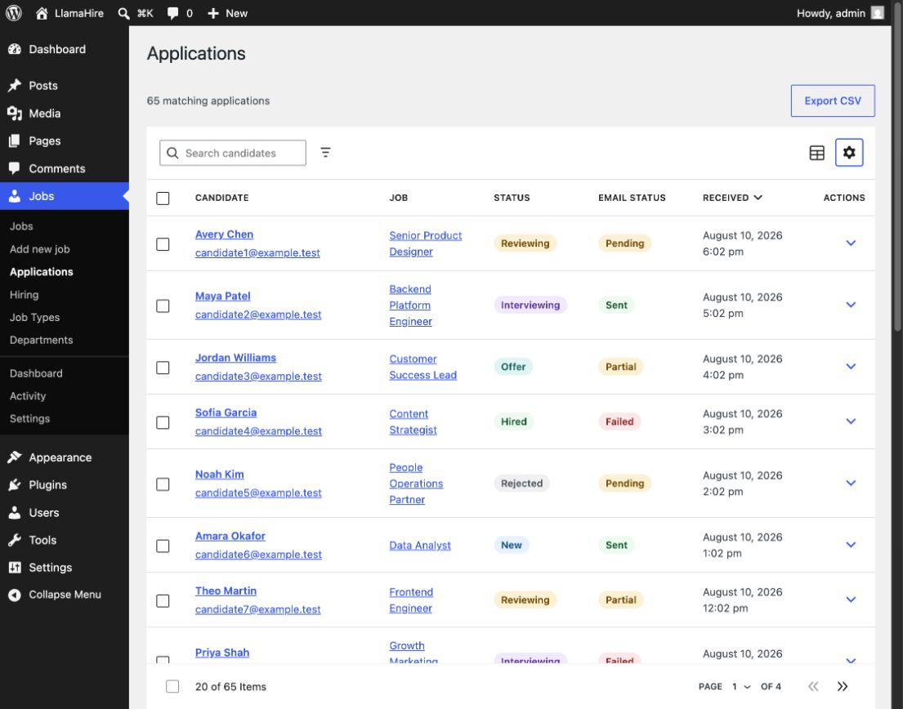
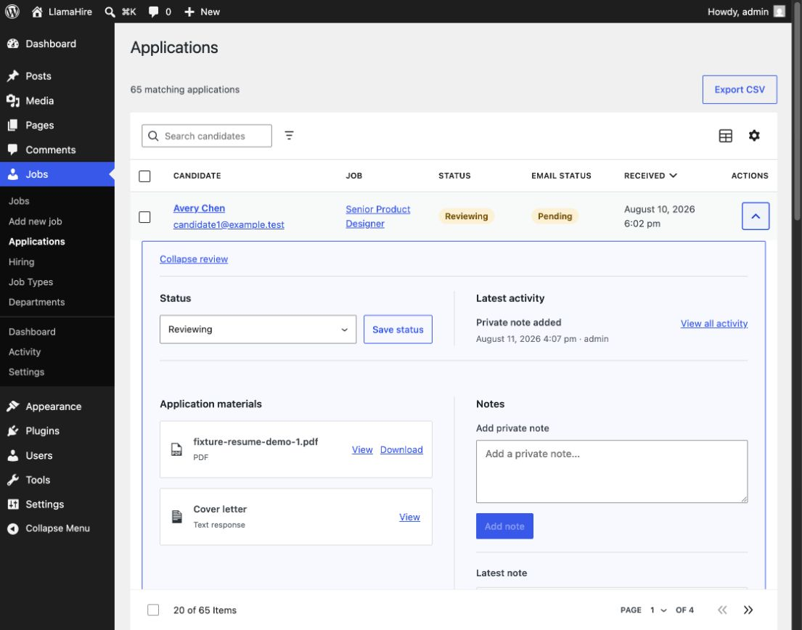
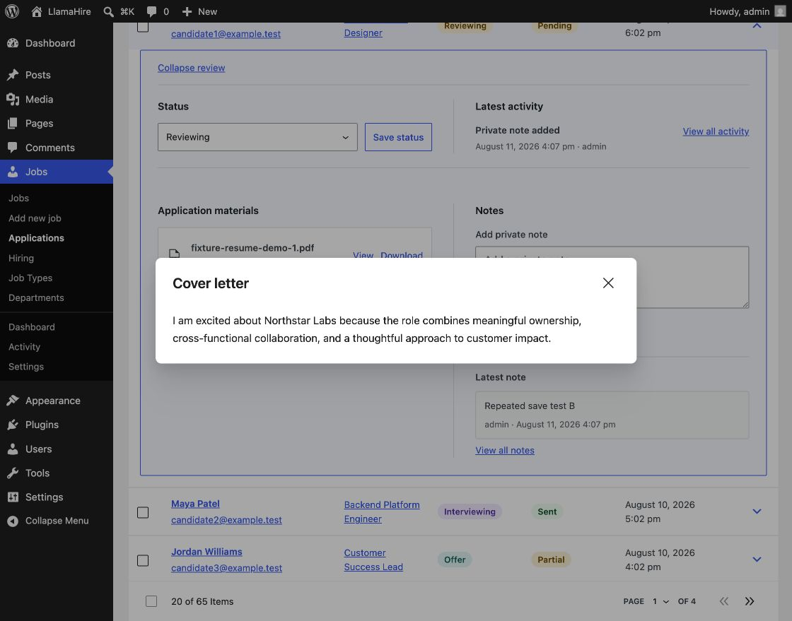
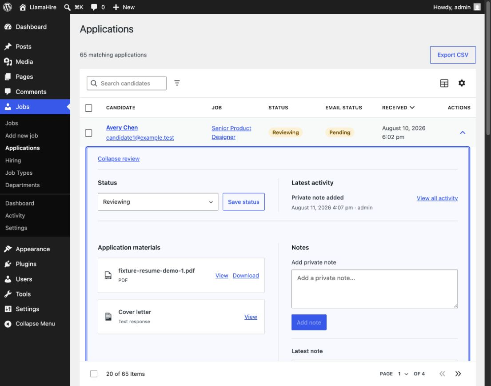
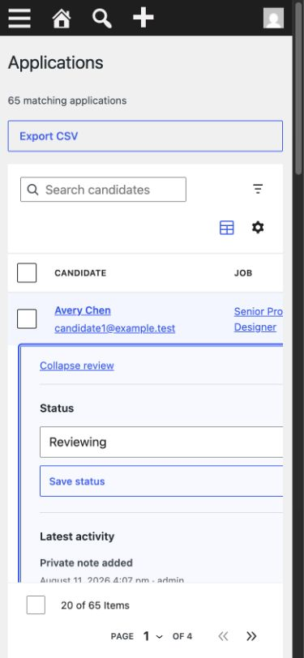

# Applications keyboard-flow review

Date: August 11, 2026

## Scope

Combined UX and accessibility review of opening an inline application review,
using its modal materials, collapsing the review, and repeating the flow at a
narrow viewport.

## Flow evidence

1. **Applications inbox — healthy.** The table has a clear scan order, labelled
   row review controls, and a compact action entry point.

   

2. **Inline review opened — fixed.** The review hierarchy is clear, but the
   opening interaction originally left focus on the row trigger. The review
   region now receives focus, has an accessible candidate-specific name, and
   shows an existing visible focus outline.

   

3. **Cover-letter modal — healthy.** WordPress Modal moves focus into the
   dialog, contains the interaction, closes with Escape or its Close button,
   and returns focus to the Cover letter View trigger.

   

4. **Corrected review entry and return — healthy.** Opening focuses the review
   region. Collapsing from inside it returns focus to the exact candidate link
   or row button that opened it rather than dropping focus onto the page body.

   

5. **Narrow review — healthy.** At 390px the review becomes a single column,
   the focus outline remains visible, controls retain their full labels, and
   the document does not introduce horizontal page overflow.

   

## Confirmed strengths

- Candidate-specific region naming gives assistive technology useful context.
- WordPress Modal already provides correct modal focus entry and return.
- Status and private-note confirmations use a stable polite live region.
- Focus treatment and content reflow remain visible at the narrow breakpoint.

## Changes made

- Stored the exact element used to open each review.
- Moved focus to the inline review region after it is rendered.
- Returned focus to the stored trigger after collapse.
- Covered link-triggered opening, modal return, and collapse return in the
  end-to-end hiring workflow.

## Evidence limits

This pass verifies browser focus state, keyboard activation in the automated
workflow, visible focus treatment, modal behavior, and 390px reflow. Actual
VoiceOver/NVDA speech output, forced colors, and 320% browser zoom remain part
of the final release-candidate accessibility matrix.
